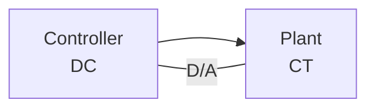

## Impulse Sampling, Zero-Order Hold (ZOH), and Pulse Transfer Function

This document summarizes the concept of data-hold, specifically focusing on the Zero-Order Hold (ZOH), and its application in digital control systems.

### Introduction: Data-Hold

Data-hold is a technique for generating a continuous-time signal from a sequence of discrete-time samples. This is crucial in digital control systems where digital controllers interact with analog plants. The most basic type of data-hold is the Zero-Order Hold (ZOH).


**Speaker's explanation (translated):** Data-hold makes a continuous signal from discrete samples. Magnitude is held constant.  A ZOH holds the amplitude of a sample constant until the next sample arrives. This creates a staircase-like output.


### Zero-Order Hold (ZOH)

A ZOH maintains the amplitude of a sampled value constant until the next sampling instant. This results in a piecewise constant, or "staircase," waveform.


**Speaker's explanation (translated):** The output is continuous in magnitude.  Let's illustrate with the Impulse Sampler...


### Impulse Sampler and ZOH Model

The impulse sampler mathematically models the sampling process by multiplying the continuous-time signal _x(t)_ with a train of Dirac delta functions (impulses). The output of the impulse sampler, _x*(t)_,  is then fed to the ZOH.


**Speaker's explanation (translated):**  If you have _x(t)_ and put it through an impulse sampler, you get _x*(t)_. In the S-domain, this is represented as _X*(S)_.  


The system can be represented in both the time domain and the complex frequency (S-domain):

* **Time Domain:**  _x(t)_  --[Impulse Sampler]--> _x*(t)_ --[ZOH]--> _h(t)_
* **S-Domain:**  _X(S)_  --[Impulse Sampler]--> _X*(S)_ --[ZOH, G<sub>h0</sub>(S)]--> _H(S)_

Where G<sub>h0</sub>(S) is the transfer function of the ZOH.

```mermaid
graph LR
    A[x(t)] --> B{Impulse sampler &};
    B --> C[x*(t)];
    C --> D[Gho(S)] --> E[h(t)];
    B --> F[X*(S)];
    F --> D;
    D --> G[H(S)];
```


### ZOH Transfer Function

The transfer function of the ZOH is given by:

**G<sub>h0</sub>(S) = (1 - e<sup>-Ts</sup>) / S**

where T is the sampling period.


**Speaker's explanation (translated):** The ZOH transfer function is (1 - e⁻ᵀˢ)/S. I'll prove this later. You might see questions asking for this transfer function.


### ZOH in Digital Control Systems

The ZOH plays a vital role in digital control systems.  Digital controllers typically operate on discrete-time signals, while the controlled plants are often analog. Therefore, the digital controller's output needs to be converted into an analog signal before being applied to the plant.


**Speaker's explanation (translated):** Most controllers are digital, but plant outputs are analog (continuous-time).  You can't directly apply digital output to an analog plant.




**Speaker's explanation (translated):** So, we must convert digital signals to analog.  A digital-to-analog converter (D/A) or holder is used for this. This holder takes the digital signal and decodes it to a sampled signal. Then, it holds this sampled signal to create a continuous magnitude signal. This process is called data reconstruction.


Another important consideration is the frequency content of signals. The sampling process introduces high-frequency components. To ensure proper operation of the analog plant, a low-pass filter is often used to remove these high-frequency components before the signal is applied to the plant.


**Speaker's explanation (translated):** Input signals usually have low frequencies (ωc). After A/D conversion, the signal is on a carrier and has a high frequency (ωs). This ωs is much higher than the original ωc. Thus, we need to remove high frequencies before the signal reaches the plant.  We do this with a low-pass filter or data reconstruction device.


### Questions and Answers

1. **What is the purpose of a data-hold circuit?**
A data-hold circuit converts a discrete-time sequence into a continuous-time signal.

2. **What is the main characteristic of a ZOH?**
A ZOH holds the amplitude of the last sampled value constant until the next sampling instant.

3. **What is the transfer function of a ZOH?**
G<sub>h0</sub>(S) = (1 - e<sup>-Ts</sup>) / S

4. **Why is a ZOH used in digital control systems?**
A ZOH is used to convert the digital output of a controller into an analog signal suitable for the analog plant.


5. **Why is a low-pass filter sometimes used in conjunction with a ZOH in digital control systems?**
A low-pass filter is used to remove high-frequency components introduced by the sampling process, ensuring the signal applied to the analog plant is within the desired frequency range.