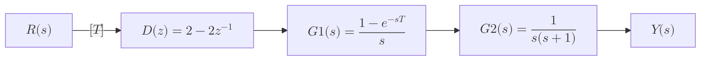

For the following open-loop discrete-time control system, if the input is a unit step function, find the response of this system if `T = 0.5 sec`.

---

*   **Input:** Unit step function, $$r(t) = u(t)$$

*   **Sampling Period:** $$T = 0.5$$ seconds

*   **Controller Transfer Function:** $$D(z) = 2 - 2z^{-1}$$

*   **G1(s):** $$H(s) = \frac{1 - e^{-sT}}{s}$$

*   **G2(s):** $$P(s) = \frac{1}{s(s + 1)}$$ 

---

The response $$Y(z)$$ is given by:
$$
Y(z) = R(z)\,D(z)\,G(z)
$$

where 
* $$R(z)$$: Input
* $$D(z)$$: Disturbancen 
* $$G(z)$$: Plant

---

#### Z-Transform of the Input R(z) (unit step function):

$$
R(z) = Z\bigl\{u(t)\bigr\} = \frac{z}{z - 1}
$$

#### Plant Transfer Function G(Z):
We can rewrite the plant function in s-Domain:
 $$G(s)$$ as a product of $$H(s)$$ and $$P(s)$$:

$$
G(s) = H(s) \cdot P(s) = \Bigl[\frac{1 - e^{-sT}}{s}\Bigr] \cdot \Bigl[\frac{1}{s(s + 1)}\Bigr] = \frac{1 - e^{-sT}}{s^{2}(s + 1)} 
$$
Decompose `G(s)` into two terms to
$$
    G(s) = \frac{1}{s^{2}(s + 1)} - \frac{e^{-sT}}{s^{2}(s + 1)}
$$

#### Find the inverse Laplace transform of the first term:
    $$
    \frac{1}{s^{2}(s + 1)}
    $$

We decompose $$\frac{1}{s^{2}(s + 1)}$$ using partial fractions:

$$
\frac{1}{s^{2}(s + 1)} = \frac{A}{s} + \frac{B}{s^{2}} + \frac{C}{s + 1}
$$

To find A, B, and C:

*   **Set s = 0:**
    

    $$1 = A(0)(0 + 1) + B(0 + 1) + C(0)^{2}$$
    

    

    $$B = 1$$
    

*   **Set s = -1:**
    

    $$1 = A(-1)(-1 + 1) + B(-1 + 1) + C(-1)^{2}$$
    

    

    $$C = 1$$
    

*   **Set s = 1:**
    

        $$1 = A(1)(1 + 1) + B(1 + 1) + C(1)^{2}$$
    

    

    $$1 = 2A + 2 + 1$$
    

    

    $$A = -1$$
    

Therefore:

$$
\frac{1}{s^{2}(s + 1)} = -\frac{1}{s} + \frac{1}{s^{2}} + \frac{1}{s + 1}
$$

**Inverse Laplace Transform:**

The inverse Laplace transform of $$\frac{1}{s^{2}(s + 1)}$$ is:

$$
\mathcal{L}^{-1}\Bigl\{\frac{1}{s^{2}(s + 1)}\Bigr\} = -1 + t + e^{-t}
$$

**Z-Transform of the First Term:**

$$
Z\{-1 + t + e^{-t}\} = -\frac{z}{z - 1} + \frac{Tz}{(z - 1)^{2}} + \frac{z}{z - e^{-T}}
$$

---
Z-Transform of the Second Term of G(s):
$$
Z\Bigl\{\frac{e^{-sT}}{s^{2}(s + 1)}\Bigr\}
$$

Using the **time-delay property**  of the z-transform for the term $$e^{-sT}$$:

$$
Z\Bigl\{\frac{e^{-sT}}{s^{2}(s + 1)}\Bigr\} = z^{-1}\,Z\Bigl\{\frac{1}{s^{2}(s + 1)}\Bigr\} = z^{-1}\Bigl[-\frac{z}{z - 1} + \frac{Tz}{(z - 1)^{2}} + \frac{z}{z - e^{-T}}\Bigr]
$$

---

$$
G(z) = \bigl[-\frac{z}{z - 1} + \frac{Tz}{(z - 1)^{2}} + \frac{z}{z - e^{-T}}\bigr] 
- z^{-1}\bigl[-\frac{z}{z - 1} + \frac{Tz}{(z - 1)^{2}} + \frac{z}{z - e^{-T}}\bigr]
$$

Simplifying:

$$
G(z) = \frac{z\,(z + T) - z - T}{(z - 1)^{2}(z - e^{-T})}
$$

---

**For T = 0.5:**

Substituting $$T = 0.5$$ and $$e^{-0.5} \approx 0.6$$:

$$
G(z) \approx \frac{z\,(z + 0.5) - z - 0.5}{(z - 1)^{2}(z - 0.6)}
$$

---

### Response Calculation:

$$
Y(z) = R(z) \cdot D(z) \cdot G(z)
$$

Therefore, $$Y(z)$$ is:

$$
Y(z) = \frac{z}{z - 1} \cdot \frac{2z - 1}{z} \cdot \frac{\frac{5}{2}}{(z - 1)^2(0.6z - 1)}
$$

$$
Y(z) = \frac{\frac{5}{2}(2z - 1)}{(z - 1)^3(0.6z - 1)}
$$

$$
2Y(z) = \frac{5(2z-1)}{(z-1)^3(0.6z-1)}
$$

**Partial Fraction Decomposition of Y(z):**

$$
\frac{\frac{5}{2}(2z - 1)}{(z - 1)^3(0.6z - 1)} = \frac{A}{z - 1} + \frac{B}{(z - 1)^2} + \frac{C}{(z - 1)^3} + \frac{D}{0.6z - 1}
$$

Multiplying both sides by $$(z - 1)^3(0.6z - 1)$$, we get:

$$
\frac{5}{2}(2z - 1) = A(z - 1)^2(0.6z - 1) + B(z - 1)(0.6z - 1) + C(0.6z - 1) + D(z - 1)^3
$$

**3. Solving for A, B, C, and D:**

*   **Find C (Set $$z = 1$$):**
    

    $$\frac{5}{2}(2(1) - 1) = A(0) + B(0) + C(0.6(1) - 1) + D(0)$$
    

    

    $$\frac{5}{2} = -0.4C$$
    

    

    $$C = -6.25$$
    

*   **Find D (Set $$z = \frac{5}{3}$$, which makes $$0.6z - 1 = 0$$):**
    

    $$\frac{5}{2}(2(\frac{5}{3}) - 1) = A(0) + B(0) + C(0) + D(\frac{5}{3} - 1)^3$$
    

    

    $$\frac{5}{2}(\frac{7}{3}) = D(\frac{2}{3})^3$$
    

    

    $$\frac{35}{6} = \frac{8}{27} \cdot D$$
    

    

    $$D = 19.6875$$
    

*   **Find B (Set `z = 0`):**

    Substitute `z = 0`, `C = -6.25`, and `D = 19.6875` into the equation:

    

    $$5/2(2(0) - 1) = A(0 - 1)²(0.6(0) - 1) + B(0 - 1)(0.6(0) - 1) + C(0.6(0) - 1) + D(0 - 1)³$$
    

    

    $$-5/2 = A(-1)²(-1) + B(-1)(-1) + (-6.25)(-1) + (19.6875)(-1)$$
    

    

    $$-5/2 = -A + B + 6.25 - 19.6875$$
    

    

    $$-2.5 = -A + B - 13.4375$$
    

    

    $$A - B = 10.9375  (Equation 1)$$
    

*   **Find A (Set `z = 2`):**

    Substitute `z = 2`, `C = -6.25`, and `D = 19.6875` into the equation:

    
    
$$\frac{5}{2}(2(2) - 1) = A(2 - 1)^{2}(0.6(2) - 1) + B(2 - 1)(0.6(2) - 1) + C(0.6(2) - 1) + D(2 - 1)^{3}$$

    
$$\frac{5}{2}(3) = A(1)^{2}(0.2) + B(1)(0.2) + (-6.25)(0.2) + (19.6875)(1)^{3}$$

    
$$7.5 = 0.2A + 0.2B - 1.25 + 19.6875$$

    
$$7.5 = 0.2A + 0.2B + 18.4375$$

    
$$0.2A + 0.2B = -10.9375$$

    
$$A + B = -54.6875 \text{ (Equation 2)}$$
  

*   **Solve for A and B using Equations 1 and 2:**

    Add Equation 1 and Equation 2:

    
    
$$ (A - B) + (A + B) = 10.9375 + (-54.6875) $$

    
$$ 2A = -43.75 $$

    
$$ A = -21.875 $$

    Substitute the value of A back into Equation 2:

    

    -21.875 + B = -54.6875
    

    

    B = -32.8125
    

**4. Complete Partial Fraction Decomposition:**

Now we have all the coefficients:

*   A = -21.875
*   B = -32.8125
*   C = -6.25
*   D = 19.6875

**Complete Partial Fraction Decomposition:**

$$
Y(z) = \frac{-21.875}{z - 1} + \frac{-32.8125}{(z - 1)^2} + \frac{-6.25}{(z - 1)^3} + \frac{19.6875}{0.6z - 1}
$$

**Inverse Z-Transform:**

The time-domain response $$y(k)$$ is: