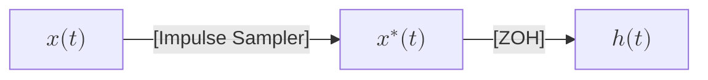
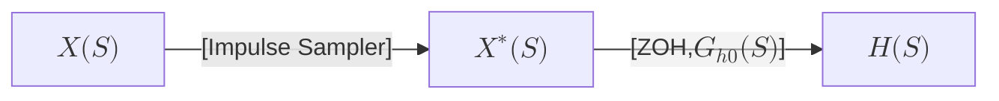
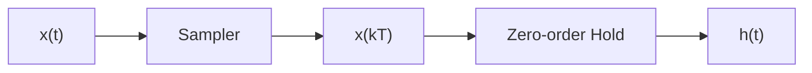
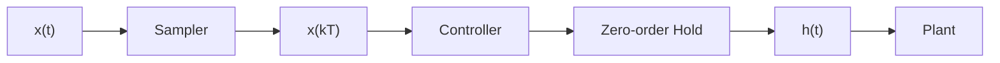
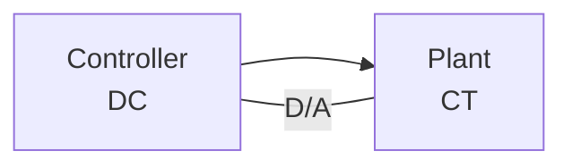

# Data Reconstruction

Digital control systems often require data reconstruction for two critical reasons:
1. **Analog Plant Compatibility:** Most controlled processes are analog and require analog inputs
2. **Frequency Component Management:** The sampling process introduces high-frequency components that must be removed before reaching the analog plant to prevent distortion

In a typical digital control system, the error signal, $$e(t)$$, is first converted to a digital signal using an **analog-to-digital converter (ADC)**. The digital controller processes this digital signal and generates a digital output, $$u(kT)$$. This digital output must then be transformed back into an analog signal using a DAC before it can be applied to the plant. The process of converting the digital control output to an analog signal for the plant is called data reconstruction. This step is essential because plants typically operate with continuous-time analog signals, making data reconstruction crucial for compatibility between the digital controller and the analog plant.

## Data Reconstruction Devices
These include low-pass filters or data reconstruction devices like a zero-order hold (ZOH). A ZOH converts a discrete-time signal into a continuous-time signal by holding each sampled value constant until the next sample arrives. 

## Data-Hold

Data-hold is a fundamental technique in digital control systems that converts a discrete-time sequence $$x(kT)$$ into a continuous-time signal $$h(t)$$ suitable for input to a physical plant. This conversion is essential because digital controllers must interact with analog plants.

The key characteristics of data-hold are:
- Converts discrete samples into a continuous signal
- Maintains constant magnitude between sampling periods
- Produces output that is continuous in magnitude
- Most commonly implemented as a Zero-Order Hold (ZOH)

*   **Real Sampler:** Works in conjunction with data-hold by taking snapshots of the continuous-time input signal at specific time instants, generating the discrete sequence for processing.

### Signal Reconstruction Theory

#### Extrapolation Process
Data reconstruction can be viewed as an extrapolation process, where:
- Future signal values are predicted based on past samples
- Signal $$f(t)$$ is estimated between $$kT$$ and $$(k + 1)T$$
- Uses previous samples: $$f((k-1)T)$$, $$f((k-2)T)$$,..., $$f(0)$$

The mathematical representation using power series expansion:

$$
f_k(t) = f(kT) + f^{(1)}(kT)(t - kT) + \frac{f^{(2)}(kT)(t- kT)^2}{2!} + ...
$$

where:
* $$f_k(t) = f(t)$$ for $$kT \leq t < (k+1)T$$
* $$f^{(n)}(kT) = \left.\frac{d^n f(t)}{dt^n}\right|_{t=kT}$$ for $$n = 1, 2,...

## Zero-Order Hold (ZOH)
The simplest type of data-hold.

**Zero-Order Hold (ZOH)** is a fundamental method for data reconstruction, converting discrete-time sequences into continuous-time signals. It's also known as a **clamper** or **staircase generator**, and is essential for digital-to-analog conversion in control systems.

ZOH "holds" the amplitude of a sampled value constant from one sampling instant $$(kT)$$ to the next $$[(k+1)T]$$. This results in a staircase-like output waveform.

### ZOH Operation and Mathematical Model

The ZOH system can be represented in both time and frequency domains:

* **Time Domain:** 

* **S-Domain:**  

The impulse sampler mathematically models the sampling process by multiplying the continuous-time signal $$x(t)$$ with a train of Dirac delta functions. The output $$x^*(t)$$ is then fed to the ZOH.

A simplified model of the real sampler and ZOH can be represented as follows:

### Frequency Response and Signal Analysis

#### Frequency Components in Sampled Signals
1. **Original Signal:** 
   - Analog signal $$x(t)$$ has frequency spectrum $$|X(j\omega)|$$
   - Centered at zero frequency ($$\omega = 0$$)
   - Extends to maximum frequency $$\pm\omega_1$$

2. **Sampled Signal:** 
   - After impulse sampling (period $$T_s$$)
   - Signal $$x^*(t)$$ has periodic frequency spectrum
   - Period = sampling frequency $$\omega_s = \frac{2\pi}{T_s}$$
   - Spectrum repeats at multiples of $$\omega_s$$

3. **Aliasing Prevention:**
   - Requires: $$\frac{\omega_s}{2} > \omega_c$$
   - $$\omega_c$$ = highest frequency in original signal
   - Prevents spectrum overlap in periodic repetition

### ZOH Transfer Function
The transfer function of a ZOH in the s-domain is given by:

$$
G_{ho}(s) = \frac{1 - e^{-T_{s}s}}{s}
$$

Where $$T_{s}$$ represents the sampling period.

A mathematical model for the sampler and ZOH in series includes the input signal $$x(t)$$, the impulse sampler, the ZOH transfer function $$G_{ho}(s)$$, and the output signal $$h(t)$$. The Laplace transforms $$X(s)$$ and the Laplace transform of the impulse-sampled signal $$X'(s)$$ are also represented in the model.

### ZOH in Digital Control Systems

In a digital control system, the sampler, controller, and ZOH are typically housed within the digital controller unit. The controller's output is a discrete sequence. To interact with the analog plant, this discrete sequence must be converted back to a continuous signal.

The process can be visualized as follows:

### Frequency Considerations
Another important consideration is the frequency content of signals. The sampling process introduces high-frequency components that affect system behavior:

- Input signals typically have low frequencies ($$\omega_c$$)
- After A/D conversion, the signal gains high-frequency components ($$\omega_s$$)
- $$\omega_s$$ is much higher than the original $$\omega_c$$
- A low-pass filter is often used to remove these high-frequency components before reaching the plant
- This filtering process is crucial for proper data reconstruction and plant operation

- **Sampling Frequency Rule:** $$\omega_s > 10\omega_c$$ (recommended)
- This ensures adequate signal representation
- Provides margin beyond Nyquist criterion
- Improves reconstruction accuracy

### Implementation Considerations
The practical implementation of ZOH typically includes:
1. Digital-to-analog converter (D/A)
2. Signal holding circuit
3. Low-pass filtering stage
4. Interface protection circuitry

Most controllers are digital, but plant outputs are analog (continuous-time).  You can't directly apply digital output to an analog plant.

### Practical Applications
1. **Signal Processing:**
   - Converts discrete controller output to analog
   - Removes unwanted frequency components
   - Maintains signal integrity

2. **System Integration:**
   - Ensures compatibility between digital and analog components
   - Prevents signal distortion
   - Optimizes control system performance

## Questions and Answers

1. **What is impulse sampling?**

    Impulse sampling is a process that converts a continuous-time signal into a discrete-time sequence by multiplying it with a train of impulses.

2. **What is the purpose of a ZOH?**

    A ZOH converts a discrete-time sequence into a continuous-time signal by holding the value of each sample constant for one sampling period.

3. **What is data reconstruction, and why is it necessary in digital control systems?**

    Data reconstruction is the process of converting the digital output of a controller into an analog signal. It's necessary because plants often operate with analog signals, ensuring compatibility between the digital controller and the analog plant.

4. **How do you obtain the z-transform of a signal from its Laplace transform?**

    You first impulse-sample the signal in the s-domain and then substitute $$e^{sT}$$ with $$z$$. Alternatively, transform to the time domain, substitute $$t$$ with $$kT_{s}$$, and apply the z-transform. Direct substitution of $$s$$ with $$\frac{1}{T_{s}}\ln(z)$$ into $$X(s)$$ is incorrect.

5. **What is the primary function of a data-hold in a digital control system?**

    To convert a discrete-time sequence into a continuous-time signal suitable for input to an analog plant.

6. **How does a zero-order hold (ZOH) generate its output signal?**

    ZOH maintains the amplitude of the current sampled value constant until the next sampling instant, creating a staircase-like waveform.

7. **What are other names for ZOH?**

    Clamper and staircase generator.

8. **Where are the sampler and ZOH typically located in a digital control system?**

    Within the digital controller unit.

9. **Why is a low-pass filter sometimes used with ZOH?**
    To remove high-frequency components ($$\omega_s$$) introduced by sampling, ensuring only desired frequencies ($$\omega_c$$) reach the plant.

10. **What happens to signal frequency during A/D conversion?**
    The signal gains high-frequency components ($$\omega_s$$) much higher than the original signal frequency ($$\omega_c$$).

11. **What is aliasing and how is it prevented?**
    Aliasing occurs when the sampling frequency is too low, causing spectrum overlap. Prevention requires sampling frequency to be more than twice the highest original signal frequency ($$\frac{\omega_s}{2} > \omega_c$$).

12. **What is the significance of the starred Laplace Transform $$X^*(s)$$?**
    It represents the sampled signal in the complex s-domain and is crucial for analyzing sampled-data systems.

13. **What is the difference between extrapolation and interpolation in signal reconstruction?**
    Extrapolation predicts values outside the range of known data points (future values), while interpolation estimates values between known data points.

14. **What is the recommended sampling frequency ratio for practical applications?**
    The sampling frequency ($$\omega_s$$) should be at least 10 times greater than the highest frequency component ($$\omega_c$$) in the original signal.
