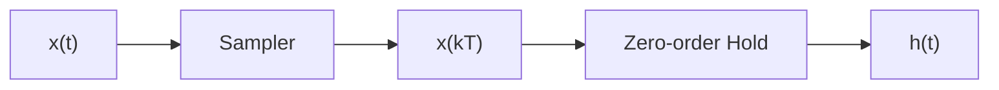
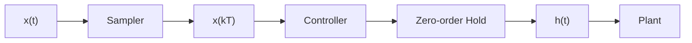

# Data Reconstruction

Digital control systems often require the conversion of the digital controller's output back into an analog signal to effectively drive the controlled plant. This process is called **data reconstruction** and is typically accomplished using devices like **digital-to-analog converters (DACs)**.

In a typical digital control system, the error signal, $$e(t)$$, is first converted to a digital signal using an **analog-to-digital converter (ADC)**. The digital controller processes this digital signal and generates a digital output, $$u(kT)$$. This digital output must then be transformed back into an analog signal using a DAC before it can be applied to the plant. The process of converting the digital control output to an analog signal for the plant is called data reconstruction. This step is essential because plants typically operate with continuous-time analog signals, making data reconstruction crucial for compatibility between the digital controller and the analog plant.

## Zero-Order Hold (ZOH)

A **Zero-Order Hold (ZOH)** is a fundamental method for data reconstruction. It's the simplest type of data-hold, converting a discrete-time sequence into a continuous-time signal by holding the value of each sample constant for the duration of the sampling period. This produces a staircase-like waveform. ZOH is also known as a **clamper** or **staircase generator**.

### Key Concepts

*   **Data-Hold:** A data-hold converts a discrete-time sequence $$x(kT)$$, generated by sampling a continuous-time signal $$x(t)$$, into a continuous-time signal $$h(t)$$ suitable for input to a physical plant.
*   **Real Sampler:** A sampler generates a discrete signal by taking snapshots of the continuous-time input signal at specific time instants.
*   **Zero-Order Hold (ZOH):** The simplest type of data-hold. ZOH "holds" the amplitude of a sampled value constant from one sampling instant $$(kT)$$ to the next $$[(k+1)T]$$. This results in a staircase-like output waveform.

### ZOH Operation and Mathematical Model

The operation of a ZOH can be visualized as follows:

1. **Continuous-Time Input:** A continuous-time signal, $$x(t)$$, is the input to the system.
2. **Sampler:** The sampler discretizes $$x(t)$$ by sampling it at regular intervals, $$T$$, generating the discrete-time sequence $$x(kT)$$.
3. **Zero-Order Hold:** The ZOH takes $$x(kT)$$ as input and generates the continuous-time output signal $$h(t)$$. It does this by holding the amplitude of each sampled value constant until the next sampling instant.

A simplified model of the real sampler and ZOH can be represented as follows:

The transfer function of a ZOH in the s-domain is given by:

$$
G_{ho}(s) = \frac{1 - e^{-T_{s}s}}{s}
$$

Where $$T_{s}$$ represents the sampling period.

A mathematical model for the sampler and ZOH in series includes the input signal $$x(t)$$, the impulse sampler, the ZOH transfer function $$G_{ho}(s)$$, and the output signal $$h(t)$$. The Laplace transforms $$X(s)$$ and the Laplace transform of the impulse-sampled signal $$X'(s)$$ are also represented in the model.

### System Diagram with Controller

In a digital control system, the sampler, controller, and ZOH are typically housed within the digital controller unit. The controller's output is a discrete sequence. To interact with the analog plant, this discrete sequence must be converted back to a continuous signal.

The process can be visualized as follows:

The signal within the controller is discretized for processing and then held constant using ZOH to generate $$h(t)$$, a continuous-time signal suitable as input to the plant.

## Questions and Answers

1. **What is impulse sampling?**

    Impulse sampling is a process that converts a continuous-time signal into a discrete-time sequence by multiplying it with a train of impulses.

2. **What is the purpose of a ZOH?**

    A ZOH converts a discrete-time sequence into a continuous-time signal by holding the value of each sample constant for one sampling period.

3. **What is data reconstruction, and why is it necessary in digital control systems?**

    Data reconstruction is the process of converting the digital output of a controller into an analog signal. It's necessary because plants often operate with analog signals, ensuring compatibility between the digital controller and the analog plant.

4. **How do you obtain the z-transform of a signal from its Laplace transform?**

    You first impulse-sample the signal in the s-domain and then substitute $$e^{sT}$$ with $$z$$. Alternatively, transform to the time domain, substitute $$t$$ with $$kT_{s}$$, and apply the z-transform. Direct substitution of $$s$$ with $$\frac{1}{T_{s}}\ln(z)$$ into $$X(s)$$ is incorrect.

5. **What is the primary function of a data-hold in a digital control system?**

    To convert a discrete-time sequence into a continuous-time signal suitable for input to an analog plant.

6. **How does a zero-order hold (ZOH) generate its output signal?**

    ZOH maintains the amplitude of the current sampled value constant until the next sampling instant, creating a staircase-like waveform.

7. **What are other names for ZOH?**

    Clamper and staircase generator.

8. **Where are the sampler and ZOH typically located in a digital control system?**

    Within the digital controller unit.
