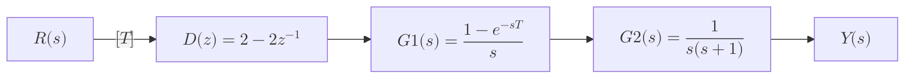

# Q1

For the following open-loop discrete-time control system, if the input is a `unit step` function, `find the response` of this system if `T = 0.5 sec`.

---

*   **Input:** Unit step function, $$r(t) = u(t)$$

*   **Sampling Period:** $$T = 0.5$$ seconds
---

The `response` $$Y(z)$$ is given by:
$$
Y(z) = R(z)\,D(z)\,G(z)
$$

---

#### Z-Transform of the Input (u(t) = 1/s), R(z):

$$
R(z) = Z\bigl\{u(t)\bigr\} = \frac{z}{z - 1}
$$

#### Plant Transfer Function G(Z):

We can rewrite the plant function in s-Domain: $$G(s)$$ as a product of $$H(s)$$ and $$P(s)$$:

$$
G(s) = G1(s) \cdot G2(s) = \Bigl[\frac{1 - e^{-sT}}{s}\Bigr] \cdot \Bigl[\frac{1}{s(s + 1)}\Bigr] = \frac{1 - e^{-sT}}{s^{2}(s + 1)}
$$

We can find $$G(z)$$ by first finding the z-transform of $$\frac{1}{s^2(s+1)}$$ and then multiplying by $$(1-z^{-1})$$:

$$
G(z) = (1-z^{-1})Z\{\frac{1}{s^2(s+1)}\}
$$

#### Find the z-transform of $$\frac{1}{s^2(s+1)}$$:
We decompose $$\frac{1}{s^{2}(s + 1)}$$ using partial fractions:

$$
\frac{1}{s^{2}(s + 1)} = \frac{A}{s} + \frac{B}{s^{2}} + \frac{C}{s + 1}
$$

To find A, B, and C:

*   **Set s = 0:**
    

    $$1 = A(0)(0 + 1) + B(0 + 1) + C(0)^{2}$$
    

    

    $$B = 1$$
    

*   **Set s = -1:**
    

    $$1 = A(-1)(-1 + 1) + B(-1 + 1) + C(-1)^{2}$$
    

    

    $$C = 1$$
    

*   **Set s = 1:**
    

    $$1 = A(1)(1 + 1) + B(1 + 1) + C(1)^{2}$$
    

    

    $$1 = 2A + 2 + 1$$
    

    

    $$A = -1$$
    

Therefore:

$$
\frac{1}{s^{2}(s + 1)} = -\frac{1}{s} + \frac{1}{s^{2}} + \frac{1}{s + 1}
$$

$$
\mathcal{L}^{-1}\Bigl\{\frac{1}{s^{2}(s + 1)}\Bigr\} = -u(t) + t + e^{-t}
$$

$$
Z\{-u(t) + t + e^{-t}\} = -\frac{z}{z - 1} + \frac{Tz}{(z - 1)^{2}} + \frac{z}{z - e^{-T}}
$$

**For T = 0.5:**

Substituting $$T = 0.5$$ and $$e^{-0.5} \approx 0.6$$:

$$
Z\{\frac{1}{s^{2}(s + 1)}\} \approx -\frac{z}{z - 1} + \frac{0.5z}{(z - 1)^{2}} + \frac{z}{z - 0.6}
$$

$$
\approx \frac{-z(z-1)(z-0.6) + 0.5z(z-0.6) + z(z-1)^2}{(z-1)^2(z-0.6)}
$$

$$
\approx \frac{-z(z^2 - 1.6z + 0.6) + 0.5z^2 - 0.3z + z(z^2 - 2z + 1)}{(z-1)^2(z-0.6)}
$$

$$
\approx \frac{-z^3 + 1.6z^2 - 0.6z + 0.5z^2 - 0.3z + z^3 - 2z^2 + z}{(z-1)^2(z-0.6)}
$$

$$
\approx \frac{0.1z^2 + 0.1z}{(z-1)^2(z-0.6)} = \frac{0.1z(z + 1)}{(z-1)^2(z-0.6)}
$$

Then:

$$
G(z) = (1-z^{-1})Z\{\frac{1}{s^2(s+1)}\} = \frac{z-1}{z} \cdot \frac{0.1z(z + 1)}{(z-1)^2(z-0.6)}
$$

$$
G(z) = \frac{0.1(z + 1)}{(z-1)(z-0.6)}
$$

---

### Response Calculation when $$D(z) = 2 - 2z^{-1}$$:

$$
Y(z) = R(z) \cdot D(z) \cdot G(z)
$$

Therefore, $$Y(z)$$ is:

$$
Y(z) = \frac{z}{z - 1} \cdot (2 - 2z^{-1}) \cdot \frac{0.1(z + 1)}{(z-1)(z-0.6)}
$$

$$
Y(z) = \frac{z}{z - 1} \cdot \frac{2(z - 1)}{z} \cdot \frac{0.1(z + 1)}{(z-1)(z-0.6)}
$$

$$
Y(z) = \frac{0.2(z + 1)}{(z - 1)(z-0.6)}
$$

**Partial Fraction Decomposition of Y(z):**

$$
\frac{0.2(z + 1)}{(z - 1)(z-0.6)} = \frac{A}{z - 1} + \frac{B}{z - 0.6}
$$

Multiplying both sides by $$(z - 1)(z - 0.6)$$, we get:

$$
0.2(z + 1) = A(z - 0.6) + B(z - 1)
$$

**Solving for A and B:**

*   **Find A (Set $$z = 1$$):**
    

    $$0.2(1 + 1) = A(1 - 0.6) + B(1 - 1)$$
    

    

    $$0.4 = 0.4A$$
    

    

    $$A = 1$$
    

*   **Find B (Set $$z = 0.6$$):**
    

    $$0.2(0.6 + 1) = A(0.6 - 1) + B(0.6 - 1)$$
    

    

    $$0.32 = -0.4B$$
    

    

    $$B = -0.8$$
    

**Complete Partial Fraction Decomposition:**

$$
Y(z) = \frac{1}{z - 1} - \frac{0.8}{z - 0.6}
$$

**Inverse Z-Transform:**

$$
y(k) = Z^{-1}\{Y(z)\} = Z^{-1}\{\frac{1}{z - 1}\} - Z^{-1}\{\frac{0.8}{z - 0.6}\}
$$

$$
y(k) = 1 - 0.8(0.6)^k
$$

Where $$k = 0, 1, 2, ...$$

This is the time-domain response of the system to a unit step input.

# 

### Response Calculation when $$D(z) = 2 - z^{-1}$$:

$$
Y(z) = R(z) \cdot D(z) \cdot G(z)
$$

Therefore, $$Y(z)$$ is:

$$
Y(z) = \frac{z}{z - 1} \cdot (2 - z^{-1}) \cdot \frac{0.1(z + 1)}{(z-1)(z-0.6)}
$$

$$
Y(z) = \frac{z}{z - 1} \cdot \frac{2z - 1}{z} \cdot \frac{0.1(z + 1)}{(z-1)(z-0.6)}
$$

$$
Y(z) = \frac{0.1(2z - 1)(z + 1)}{(z - 1)^2(z-0.6)}
$$

**Partial Fraction Decomposition of $$Y(z)$$:**

To simplify the process, we'll first find the partial fraction decomposition of $$Y(z)/z$$:

$$
\frac{Y(z)}{z} = \frac{0.1 \cdot (2z - 1) \cdot (z + 1)}{z \cdot (z - 1)^2 \cdot (z - 0.6)}
$$

$$
\frac{Y(z)}{z} = \frac{A}{z} + \frac{B}{z - 1} + \frac{C}{(z - 1)^2} + \frac{D}{z - 0.6}
$$

Multiplying both sides by $$z(z - 1)^2(z - 0.6)$$:

$$
0.1 \cdot (2z - 1) \cdot (z + 1) = A(z - 1)^2(z - 0.6) + Bz(z - 1)(z - 0.6) + Cz(z - 0.6) + Dz(z - 1)^2
$$

*   **Let $$z = 0$$:**
    

    $$0.1 \cdot (-1) \cdot (1) = A(-1)^2(-0.6)$$
    

    

    $$-0.1 = -0.6A$$
    

    

    $$A = \frac{1}{6}$$
    

*   **Let $$z = 1$$:**
    

    $$0.1 \cdot (1) \cdot (2) = C(1)(0.4)$$
    

    

    $$0.2 = 0.4C$$
    

    

    $$C = 0.5$$
    

*   **Let $$z = 0.6$$:**
    

    $$0.1 \cdot (0.2) \cdot (1.6) = D(0.6)(-0.4)^2$$
    

    

    $$0.032 = 0.096D$$
    

    

    $$D = \frac{1}{3}$$
    

*   **To find $$B$$, substitute a suitable value of $$z$$ (e.g., $$z = 2$$) into the equation:**
    

    $$
    0.1 \cdot (2z - 1) \cdot (z + 1) = A(z - 1)^2(z - 0.6) + Bz(z - 1)(z - 0.6) + Cz(z - 0.6) + Dz(z - 1)^2
    $$
    

    

    Substitute $$z = 2$$, $$A = \frac{1}{6}$$, $$C = 0.5$$, and $$D = \frac{1}{3}$$:
    

    

    $$
    0.1 \cdot (3) \cdot (3) = \frac{1}{6}(1.4) + B(2)(1.4) + 0.5(2)(1.4) + \frac{1}{3}(2)
    $$
    

    

    $$
    0.9 = \frac{7}{30} + 2.8B + 1.4 + \frac{2}{3}
    $$
    

    

    $$
    B = -\frac{1}{2}
    $$
    

**Substitute the Constants Back into $$Y(z)/z$$**

$$
\frac{Y(z)}{z} = \frac{(1/6)}{z} - \frac{0.5}{z - 1} + \frac{0.5}{(z - 1)^2} + \frac{(1/3)}{z - 0.6}
$$

Multiply both sides by $$z$$ to get $$Y(z)$$:

$$
Y(z) = \frac{1}{6} - \frac{0.5 z}{z - 1} + \frac{0.5z}{(z - 1)^2} + \frac{(1/3)z}{z - 0.6}
$$

**Take the Inverse Z-Transform**

$$
y[n] = \frac{1}{6}\delta[n] - 0.5u[n] + 0.5nu[n] + \frac{1}{3}(0.6)^n u[n]
$$

:::tip
*   $$\mathcal{Z}^{-1}\left\{\frac{1}{6}\right\} = \frac{1}{6}\delta[n]$$
*   $$\mathcal{Z}^{-1}\left\{\frac{z}{z - 1}\right\} = u[n]$$
*   $$\mathcal{Z}^{-1}\left\{\frac{z}{(z - 1)^2}\right\} = n \cdot u[n]$$
*   $$\mathcal{Z}^{-1}\left\{\frac{z}{z - a}\right\} = a^n \cdot u[n]$$
:::

---

---

# Q2

Given the input $$R(s) = \frac{1}{s}$$ (which represents a unit step function) and the initial condition $$y(0) = 1$$, find:

1. The pulse transfer function,
2. The discrete-time state space representation,
3. The stability of the system,

where the system's difference equation is given by:

$$
y(k+3) + 2y(k+2) + 3y(k+1) + 2y(k) = r(k+1) + r(k)
$$

---

### 1. Pulse Transfer Function

To find the pulse transfer function $$G(z) = \frac{Y(z)}{R(z)}$$, we take the Z-transform of the difference equation assuming zero initial conditions:

$$
z^3 Y(z) + 2z^2 Y(z) + 3z Y(z) + 2Y(z) = z R(z) + R(z)
$$

Solving for $$G(z)$$:

$$
G(z) = \frac{Y(z)}{R(z)} = \frac{z + 1}{z^3 + 2z^2 + 3z + 2}
$$

---

### 2. Discrete-Time State Space Representation

We define the state variables as:

$$
x_1(k) = y(k), \quad x_2(k) = y(k+1), \quad x_3(k) = y(k+2)
$$

The state equations are:

$$
\begin{aligned}
x_1(k+1) &= x_2(k) \\
x_2(k+1) &= x_3(k) \\
x_3(k+1) &= -2x_3(k) - 3x_2(k) - 2x_1(k) + r(k+1) + r(k)
\end{aligned}
$$

In matrix form:

$$
x(k+1) = \begin{bmatrix}
0 & 1 & 0 \\
0 & 0 & 1 \\
-2 & -3 & -2
\end{bmatrix} x(k) + \begin{bmatrix}
0 \\
0 \\
1
\end{bmatrix} r(k+1) + \begin{bmatrix}
0 \\
0 \\
1
\end{bmatrix} r(k)
$$

The output equation is:

$$
y(k) = \begin{bmatrix} 1 & 0 & 0 \end{bmatrix} x(k)
$$

---

### 3. Stability of the System

:::tip
System stability in the Z-domain is analyzed using the unit circle. The poles of the system's transfer function, when plotted in the Z-plane, determine its stability characteristics:

- **Stable System:** All poles lie inside the unit circle.
- **Unstable System:** At least one pole lies outside the unit circle.
- **Marginally Stable System:** At least one pole lies on the unit circle, and no poles lie outside.

To assess stability, we find the poles of the transfer function by solving:
:::

$$
z^3 + 2z^2 + 3z + 2 = 0
$$

One root is $$z = -1$$. Factoring:

$$
(z + 1)(z^2 + z + 2) = 0
$$

The remaining roots are:

$$
z = \frac{-1 \pm j\sqrt{7}}{2}
$$

The magnitudes of these roots are:

$$
|z| = \sqrt{\left(\frac{-1}{2}\right)^2 + \left(\frac{\sqrt{7}}{2}\right)^2} = \sqrt{\frac{1}{4} + \frac{7}{4}} = \sqrt{2} \approx 1.414
$$

Since $$\sqrt{2} > 1$$, these poles lie **outside** the unit circle. Additionally, the pole at $$z = -1$$ lies **on** the unit circle.

---

---

# Q3

Given the input $$R(s) = \frac{1}{s}$$ (which represents a unit step function) and the initial condition $$y(0) = 0$$, find:

1. The pulse transfer function,
2. The discrete-time state space representation,
3. The stability of the system,

where the system's difference equation is given by:

$$
y(k+2) + 3y(k+1) + 4y(k) = 2r(k+1) + r(k)
$$

---

### 1. Pulse Transfer Function

The given difference equation is:

$$
y(k+2) + 3y(k+1) + 4y(k) = 2r(k+1) + r(k)
$$

Taking the Z-transform of both sides:

$$
z^2 Y(z) + 3z Y(z) + 4Y(z) = 2z R(z) + R(z)
$$

$$R(z) = \frac{z}{z-1}$$. Substituting and simplifying:

$$
(z^2 + 3z + 4) Y(z) = 2z R(z) + R(z)
$$

$$
Y(z) = \frac{2z + 1}{z^2 + 3z + 4} R(z)
$$

Thus, the pulse transfer function is:

$$
G(z) = \frac{Y(z)}{R(z)} = \frac{2z + 1}{z^2 + 3z + 4}
$$

---

### 2. Discrete-Time State Space Representation

Define state variables:

$$
x_1(k) = y(k), \quad x_2(k) = y(k+1)
$$

From the difference equation:

$$
y(k+2) = -3y(k+1) - 4y(k) + 2r(k+1) + r(k)
$$

The state equations are:

$$
x_1(k+1) = x_2(k)
$$

$$
x_2(k+1) = -4x_1(k) - 3x_2(k) + 2r(k+1) + r(k)
$$

In matrix form:

$$
\begin{bmatrix}
x_1(k+1) \\
x_2(k+1)
\end{bmatrix}
=
\begin{bmatrix}
0 & 1 \\
-4 & -3
\end{bmatrix}
\begin{bmatrix}
x_1(k) \\
x_2(k)
\end{bmatrix}
+
\begin{bmatrix}
0 \\
2
\end{bmatrix}
r(k+1)
+
\begin{bmatrix}
0 \\
1
\end{bmatrix}
r(k)
$$

The output equation is:

$$
y(k) = \begin{bmatrix} 1 & 0 \end{bmatrix} \begin{bmatrix} x_1(k) \\ x_2(k) \end{bmatrix}
$$

---

### 3. Stability of the System

:::tip
System stability in the Z-domain is analyzed using the unit circle. The poles of the system's transfer function, when plotted in the Z-plane, determine its stability characteristics:

- **Stable System**: All poles lie inside the unit circle.
- **Unstable System**: At least one pole lies outside the unit circle.
- **Marginally Stable System**: At least one pole lies on the unit circle, and no poles lie outside.
:::

The poles of the transfer function are found by solving:

$$
z^2 + 3z + 4 = 0
$$

The roots are:

$$
z = \frac{-3 \pm \sqrt{9 - 16}}{2} = \frac{-3 \pm \sqrt{-7}}{2} = -1.5 \pm j1.322
$$

The magnitude of these poles is:

$$
|z| = \sqrt{(-1.5)^2 + (1.322)^2} = \sqrt{2.25 + 1.748} = \sqrt{3.998} \approx 2
$$

Since the magnitude of the poles ($$|z| \approx 2$$) is **greater than 1**, the poles lie **outside the unit circle**. Therefore, the system is **unstable**.

---

---

# Q4

We are dealing with a 4-bit word length A/D Converter with a full-scale range of $$\pm10$$ volts. We need to address the following:

1. Draw the block diagram of a discrete-time control system.
2. Draw the functional block diagram for the A/D converter.
3. Determine the quantization level and the quantization error.
4. The maximum output analog voltage that can be converted.
5. Create a table for the conversion from analog to digital.
6. Find the digital number equivalent of a $$-6.5$$ V input.

---

### 3. Quantization Level and Quantization Error

`Quantization Level ($$q$$)`: is the smallest change in voltage that can be detected by the A/D converter. It is calculated as:

$$
q = \frac{20}{2^4} = \frac{20}{16} = 1.25 \text{ volts}
$$

`Quantization Error`: is the maximum possible error due to quantization, which is half of the quantization level:

$$
\text{Quantization Error} = \frac{q}{2} = \frac{1.25}{2} = 0.625 \text{ volts}
$$

---

### 4. Maximum Output Analog Voltage That Can Be Converted

The maximum output analog voltage that can be converted is given by:

$$
V_{\text{max}} = \frac{2^n - 1}{2^n} \cdot \text{F.S} + \frac{q}{2}
$$

In positive terms:

$$
V_{\text{max}} = \frac{2^4 - 1}{2^4} \cdot 10 + 0.625 = 10 \text{ volts}
$$

In negative terms:

$$
V_{\text{min}} = -\frac{2^4 - 1}{2^4} \cdot (-10) - 0.625 = -10 \text{ volts}
$$

---

### 5. Conversion Table from Analog to Digital

  

    |                         | Decimal       | Binary |
    |-------------------------|---------------|--------|
    | $$+1 \cdot q/2$$        | $$+0.625$$    | $$0000$$ |
    | $$+3 \cdot q/2$$        | $$+1.875$$    | $$0001$$ |
    | $$+5 \cdot q/2$$        | $$+3.125$$    | $$0010$$ |
    | $$+7 \cdot q/2$$        | $$+4.375$$    | $$0011$$ |
    | $$+9 \cdot q/2$$        | $$+5.625$$    | $$0100$$ |
    | $$+11 \cdot q/2$$       | $$+6.875$$    | $$0101$$ |
    | $$+13 \cdot q/2$$       | $$+8.125$$    | $$0110$$ |
    | $$+15 \cdot q/2$$       | $$+9.375$$    | $$0111$$ |
  

  

    |                         | Decimal       | Binary |
    |-------------------------|---------------|--------|
    | $$-1 \cdot q/2$$        | $$-0.625$$    | $$1000$$ |
    | $$-3 \cdot q/2$$        | $$-1.875$$    | $$1001$$ |
    | $$-5 \cdot q/2$$        | $$-3.125$$    | $$1010$$ |
    | $$-7 \cdot q/2$$        | $$-4.375$$    | $$1011$$ |
    | $$-9 \cdot q/2$$        | $$-5.625$$    | $$1100$$ |
    | $$-11 \cdot q/2$$       | $$-6.875$$    | $$1101$$ |
    | $$-13 \cdot q/2$$       | $$-8.125$$    | $$1110$$ |
    | $$-15 \cdot q/2$$       | $$-9.375$$    | $$1111$$ |
  

---

### 6. Digital Number Equivalent of a $$-6.5$$ V Input

To find the digital number equivalent of a $$-6.5$$ V input, we need to determine which quantization level $$-6.5$$ V falls into.

From the negative values table:

- $$-6.875$$ V corresponds to $$-6$$ (binary $$1101$$)
- $$-5.625$$ V corresponds to $$-5$$ (binary $$1100$$)

Since $$-6.5$$ V is closer to $$-6.875$$ V than to $$-5.625$$ V, the digital number equivalent is:

- **Decimal:** $$-6$$
- **Binary:** $$1101$$

---

---

# Q5

Find the z-transform of 
$$
\frac{1}{s^2(s+1)}
$$

We decompose $$\frac{1}{s^{2}(s + 1)}$$ using partial fractions:

$$
\frac{1}{s^{2}(s + 1)} = \frac{A}{s} + \frac{B}{s^{2}} + \frac{C}{s + 1}
$$

To find A, B, and C:

*   **Set s = 0:**
    

    $$1 = A(0)(0 + 1) + B(0 + 1) + C(0)^{2}$$
    

    

    $$B = 1$$
    

*   **Set s = -1:**
    

    $$1 = A(-1)(-1 + 1) + B(-1 + 1) + C(-1)^{2}$$
    

    

    $$C = 1$$
    

*   **Set s = 1:**
    

    $$1 = A(1)(1 + 1) + B(1 + 1) + C(1)^{2}$$
    

    

    $$1 = 2A + 2 + 1$$
    

    

    $$A = -1$$
    

Therefore:

$$
\frac{1}{s^{2}(s + 1)} = -\frac{1}{s} + \frac{1}{s^{2}} + \frac{1}{s + 1}
$$

$$
\mathcal{L}^{-1}\Bigl\{\frac{1}{s^{2}(s + 1)}\Bigr\} = -1 + t + e^{-t}
$$

$$
Z\{-1 + t + e^{-t}\} = -\frac{z}{z - 1} + \frac{Tz}{(z - 1)^{2}} + \frac{z}{z - e^{-T}}
$$

---

---

# Q6

Find the Z-transform for the following transfer function:

$$
F(s) = \frac{s + \omega}{(s + \omega)^2 + \omega^2}
$$

$$
f(t) = e^{-\omega t}\cos(\omega t)
$$

$$
F(z) = \frac{z^2 - z\,e^{-\omega T}\cos(\omega T)}{z^2 - 2z\,e^{-\omega T}\cos(\omega T) + e^{-2\omega T}}
$$

:::info

| $$x(t)$$                  | $$X(s)$$       | $$X(z)$$                                                                 |
|---------------------------|----------------|--------------------------------------------------------------------------|
| $$\cos(\omega t)$$        | $$\frac{s}{s^2 + \omega^2}$$ | $$\frac{z(z - \cos(\omega T))}{z^2 - 2z \cos(\omega T) + 1}$$           |
| $$e^{-at} \cos(\omega t)$$| $$\frac{s + a}{(s + a)^2 + \omega^2}$$ | $$\frac{z^2 - z e^{-aT} \cos(\omega T)}{z^2 - 2z e^{-aT} \cos(\omega T) + e^{-2aT}}$$ |

:::

---

---

# Q7

The control system is represented in state-space form with:

$$
x(k+1) = Ax(k) + Bu(k)
$$

$$
y(k) = Cx(k)
$$

matrices $$A$$, $$B$$ and $$C$$ with appropriate dimensions.

1. Drive Pulse transfer function if

    $$
    A = \begin{bmatrix} 0 & 1 \\ -0.16 & 1 \end{bmatrix}, B = \begin{bmatrix} 1 \\ 1 \end{bmatrix}, C = \begin{bmatrix} 3 & 2 \end{bmatrix}
    $$
2. Check stability of the system.
3. Find the difference equation that represents that system.

---

## 1. Derive Pulse Transfer Function

The pulse transfer function $$G(z)$$ can be derived from the state-space representation using the following formula:

$$
G(z) = C(zI - A)^{-1}B
$$

:::tip
Take $$z$$ transform for state space equation.

$$
zx(z) = Ax(z) + Bu(z)
$$

$$
\therefore (zI - A)x(z) = Bu(z)
$$

$$
\therefore x(z) = (zI - A)^{-1}Bu(z)
$$

And for output equation:
$$
y(z) = Cx(z)
$$

$$
\therefore G(z) = C(zI - A)^{-1}B
$$
:::

where $$I$$ is the identity matrix of the same dimension as $$A$$.

### Calculate $$(zI - A)$$:

$$
zI - A = z \begin{bmatrix} 1 & 0 \\ 0 & 1 \end{bmatrix} - \begin{bmatrix} 0 & 1 \\ -0.16 & -1 \end{bmatrix} = \begin{bmatrix} z & -1 \\ 0.16 & z+1 \end{bmatrix}
$$

### Calc $$(zI - A)^{-1}$$:
:::tip
For a 2x2 matrix, the inverse is given by:

$$
\begin{bmatrix} a & b \\ c & d \end{bmatrix}^{-1} =
\frac{1}{det(A)} \begin{bmatrix} d & -b \\ -c & a \end{bmatrix} =
\frac{1}{ad-bc} \begin{bmatrix} d & -b \\ -c & a \end{bmatrix}
$$
:::

The determinant is:

$$
\text{det}(zI - A) = z(z + 1) + 0.16 = z^2 + z + 0.16
$$

$$
(zI - A)^{-1} = \frac{1}{det(A)} \begin{bmatrix} z+1 & 1 \\ -0.16 & z \end{bmatrix} = \frac{1}{z^2 + z + 0.16} \begin{bmatrix} z+1 & 1 \\ -0.16 & z \end{bmatrix}
$$

### Calculate $$(zI - A)^{-1} B$$:

$$
(zI - A)^{-1} B =
\frac{1}{z^2 + z + 0.16} \begin{bmatrix} z+1 & 1 \\ -0.16 & z \end{bmatrix} \begin{bmatrix} 1 \\ 1 \end{bmatrix} =
\frac{1}{z^2 + z + 0.16} \begin{bmatrix} z + 2 \\ z - 0.16 \end{bmatrix}
$$

### $$G(z)$$:

$$
G(z) = C(zI - A)^{-1}B =
\frac{1}{z^2 + z + 0.16} \begin{bmatrix} 3 & 2 \end{bmatrix} \begin{bmatrix} z+2 \\ z-0.16 \end{bmatrix}
$$

$$
G(z) = \frac{1}{z^2 + z + 0.16} (3(z+2) + 2(z-0.16))
$$

$$
G(z) = \frac{5z + 5.68}{z^2 + z + 0.16}
$$

---

## 2. Check Stability of the System

The system is stable if all poles of $$G(z)$$ lie inside the unit circle. The poles are the roots of the denominator:

$$
z^2 + z + 0.16 = 0
$$

Solving:

$$
z = \frac{-1 \pm \sqrt{1 - 0.64}}{2} = \frac{-1 \pm 0.6}{2}
$$

Thus:

$$
z_1 = -0.2, \quad z_2 = -0.8
$$

Both poles have magnitudes less than 1, so the system is stable.

---

## 3. Find the Difference Equation

From the transfer function:

$$
G(z) = \frac{5z + 5.68}{z^2 + z + 0.16}
$$

Multiply both sides by the denominator:

$$
Y(z)(z^2 + z + 0.16) = U(z)(5z + 5.68)
$$

Taking the inverse Z-transform:

$$
y(k+2) + y(k+1) + 0.16 y(k) = 5 u(k+1) + 5.68 u(k)
$$

:::tip
Additional Steps:

Rearranged to express $$y(k)$$ in terms of past values:

$$
y(k) = -y(k-1) - 0.16 y(k-2) + 5 u(k-1) + 5.68 u(k-2)
$$
$$
:::

---

---

# Q8

Consider a discrete time system described by the following state space equations.
$$
X(K+1) = \begin{bmatrix} 0.8 & 0.2 \\ -0.1 & 0.9 \end{bmatrix} x(k) + \begin{bmatrix} 1 \\ 0 \end{bmatrix} u(k)
$$

$$
y(k) = \begin{bmatrix} 1 & 0 \end{bmatrix} x(k)
$$

1. Find the Pulse transfer function
2. Determine the stability of the system
3. Find the difference equation relating the input $$u(k)$$ and the output $$y(k)$$

The control system is represented in state-space form with:

$$
x(k+1) = Ax(k) + Bu(k)
$$

$$
y(k) = Cx(k)
$$

matrices $$A$$, $$B$$ and $$C$$ with appropriate dimensions.

1. Drive Pulse transfer function if

    $$
    A = \begin{bmatrix} 0.8 & 0.2 \\ -0.1 & 0.9 \end{bmatrix}, B = \begin{bmatrix} 1 \\ 0 \end{bmatrix}, C = \begin{bmatrix} 1 & 0 \end{bmatrix}
    $$
2. Check stability of the system.
3. Find the difference equation that represents that system.

---

## 1. Derive Pulse Transfer Function

The pulse transfer function $$G(z)$$ can be derived from the state-space representation using the following formula:

$$
G(z) = C(zI - A)^{-1}B
$$

where $$I$$ is the identity matrix of the same dimension as $$A$$.

### Calculate $$(zI - A)$$:

$$
zI - A = z \begin{bmatrix} 1 & 0 \\ 0 & 1 \end{bmatrix} - \begin{bmatrix} 0.8 & 0.2 \\ -0.1 & 0.9 \end{bmatrix} = \begin{bmatrix} z - 0.8 & -0.2 \\ 0.1 & z - 0.9 \end{bmatrix}
$$

### Calculate $$(zI - A)^{-1}$$:

The determinant is:

$$
\text{det}(zI - A) = (z - 0.8)(z - 0.9) - (-0.2)(0.1) = z^2 - 1.7z + 0.74
$$

$$
(zI - A)^{-1} = \frac{1}{z^2 - 1.7z + 0.74} \begin{bmatrix} z - 0.9 & 0.2 \\ -0.1 & z - 0.8 \end{bmatrix}
$$

### Calculate $$(zI - A)^{-1} B$$:

$$
(zI - A)^{-1} B = \frac{1}{z^2 - 1.7z + 0.74} \begin{bmatrix} z - 0.9 & 0.2 \\ -0.1 & z - 0.8 \end{bmatrix} \begin{bmatrix} 1 \\ 0 \end{bmatrix} = \frac{1}{z^2 - 1.7z + 0.74} \begin{bmatrix} z - 0.9 \\ -0.1 \end{bmatrix}
$$

### $$G(z)$$:

$$
G(z) = C(zI - A)^{-1}B = \frac{1}{z^2 - 1.7z + 0.74} \begin{bmatrix} 1 & 0 \end{bmatrix} \begin{bmatrix} z - 0.9 \\ -0.1 \end{bmatrix}
$$

$$
G(z) = \frac{z - 0.9}{z^2 - 1.7z + 0.74}
$$

---

## 2. Check Stability of the System

The system is stable if all poles of $$G(z)$$ lie inside the unit circle. The poles are the roots of the denominator:

$$
z^2 - 1.7z + 0.74 = 0
$$

poles are:
$$
z = \frac{1.7 \pm j\sqrt{0.07}}{2}
$$

Thus:

$$
z_1 = \frac{1.7 + j\sqrt{0.07}}{2} \approx 0.85 + 0.1323j, \quad z_2 = \frac{1.7 - j\sqrt{0.07}}{2} \approx 0.85 - 0.1323j
$$

The magnitude of these complex poles is:

$$
|z| = \sqrt{(0.85)^2 + (\pm 0.1323)^2} \approx \sqrt{0.7225 + 0.0175} \approx \sqrt{0.74} \approx 0.8602
$$

Both poles have magnitudes less than 1, so the system is stable.

---

## 3. Find the Difference Equation

From the transfer function:

$$
G(z) = \frac{z - 0.9}{z^2 - 1.7z + 0.74}
$$

Multiply both sides by the denominator:

$$
Y(z)(z^2 - 1.7z + 0.74) = U(z)(z - 0.9)
$$

Taking the inverse Z-transform:

$$
y(k+2) - 1.7y(k+1) + 0.74y(k) = u(k+1) - 0.9u(k)
$$

Rearranging to express $$y(k)$$ in terms of past values:

$$
y(k) = 1.7y(k-1) - 0.74y(k-2) + u(k-1) - 0.9u(k-2)
$$

---

---

