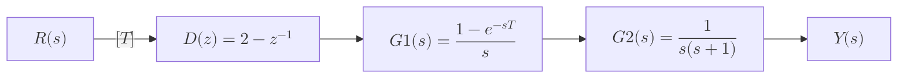

# 

For the following open-loop discrete-time control system, if the input is a `unit step` function, `find the response` of this system if `T = 0.5 sec`.

---

*   **Input:** Unit step function, $$r(t) = u(t)$$

*   **Sampling Period:** $$T = 0.5$$ seconds
---

The `response` $$Y(z)$$ is given by:
$$
Y(z) = R(z)\,D(z)\,G(z)
$$

---

#### Z-Transform of the Input (u(t) = 1/s), R(z):

$$
R(z) = Z\bigl\{u(t)\bigr\} = \frac{z}{z - 1}
$$

#### Plant Transfer Function G(Z):

We can rewrite the plant function in s-Domain: $$G(s)$$ as a product of $$H(s)$$ and $$P(s)$$:

$$
G(s) = H(s) \cdot P(s) = \Bigl[\frac{1 - e^{-sT}}{s}\Bigr] \cdot \Bigl[\frac{1}{s(s + 1)}\Bigr] = \frac{1 - e^{-sT}}{s^{2}(s + 1)}
$$

We can find $$G(z)$$ by first finding the z-transform of $$\frac{1}{s^2(s+1)}$$ and then multiplying by $$(1-z^{-1})$$:

$$
G(z) = (1-z^{-1})Z\{\frac{1}{s^2(s+1)}\}
$$

#### Find the z-transform of $$\frac{1}{s^2(s+1)}$$:
We decompose $$\frac{1}{s^{2}(s + 1)}$$ using partial fractions:

$$
\frac{1}{s^{2}(s + 1)} = \frac{A}{s} + \frac{B}{s^{2}} + \frac{C}{s + 1}
$$

To find A, B, and C:

*   **Set s = 0:**
    

    $$1 = A(0)(0 + 1) + B(0 + 1) + C(0)^{2}$$
    

    

    $$B = 1$$
    

*   **Set s = -1:**
    

    $$1 = A(-1)(-1 + 1) + B(-1 + 1) + C(-1)^{2}$$
    

    

    $$C = 1$$
    

*   **Set s = 1:**
    

    $$1 = A(1)(1 + 1) + B(1 + 1) + C(1)^{2}$$
    

    

    $$1 = 2A + 2 + 1$$
    

    

    $$A = -1$$
    

Therefore:

$$
\frac{1}{s^{2}(s + 1)} = -\frac{1}{s} + \frac{1}{s^{2}} + \frac{1}{s + 1}
$$

$$
\mathcal{L}^{-1}\Bigl\{\frac{1}{s^{2}(s + 1)}\Bigr\} = -1 + t + e^{-t}
$$

$$
Z\{-1 + t + e^{-t}\} = -\frac{z}{z - 1} + \frac{Tz}{(z - 1)^{2}} + \frac{z}{z - e^{-T}}
$$

**For T = 0.5:**

Substituting $$T = 0.5$$ and $$e^{-0.5} \approx 0.6$$:

$$
Z\{\frac{1}{s^{2}(s + 1)}\} \approx -\frac{z}{z - 1} + \frac{0.5z}{(z - 1)^{2}} + \frac{z}{z - 0.6}
$$

$$
\approx \frac{-z(z-1)(z-0.6) + 0.5z(z-0.6) + z(z-1)^2}{(z-1)^2(z-0.6)}
$$

$$
\approx \frac{-z(z^2 - 1.6z + 0.6) + 0.5z^2 - 0.3z + z(z^2 - 2z + 1)}{(z-1)^2(z-0.6)}
$$

$$
\approx \frac{-z^3 + 1.6z^2 - 0.6z + 0.5z^2 - 0.3z + z^3 - 2z^2 + z}{(z-1)^2(z-0.6)}
$$

$$
\approx \frac{0.1z^2 + 0.1z}{(z-1)^2(z-0.6)} = \frac{0.1z(z + 1)}{(z-1)^2(z-0.6)}
$$

Then:

$$
G(z) = (1-z^{-1})Z\{\frac{1}{s^2(s+1)}\} = \frac{z-1}{z} \cdot \frac{0.1z(z + 1)}{(z-1)^2(z-0.6)}
$$

$$
G(z) = \frac{0.1(z + 1)}{(z-1)(z-0.6)}
$$

---

### Response Calculation when $$D(z) = 2 - z^{-1}$$:

$$
Y(z) = R(z) \cdot D(z) \cdot G(z)
$$

Therefore, $$Y(z)$$ is:

$$
Y(z) = \frac{z}{z - 1} \cdot (2 - z^{-1}) \cdot \frac{0.1(z + 1)}{(z-1)(z-0.6)}
$$

$$
Y(z) = \frac{z}{z - 1} \cdot \frac{2z - 1}{z} \cdot \frac{0.1(z + 1)}{(z-1)(z-0.6)}
$$

$$
Y(z) = \frac{0.1(2z - 1)(z + 1)}{(z - 1)^2(z-0.6)}
$$

**Partial Fraction Decomposition of $$Y(z)$$:**

$$
\frac{0.1(2z - 1)(z + 1)}{(z - 1)^2(z-0.6)} = \frac{A}{z - 1} + \frac{B}{(z - 1)^2} + \frac{C}{z - 0.6}
$$

Multiplying both sides by $$(z - 1)^2(z - 0.6)$$, we get:

$$
0.1(2z - 1)(z + 1) = A(z - 1)(z - 0.6) + B(z - 0.6) + C(z - 1)^2
$$

**Solving for A, B, and C:**

*   **Find B (Set $$z = 1$$):**
    

    $$0.1(2(1) - 1)(1 + 1) = A(1 - 1)(1 - 0.6) + B(1 - 0.6) + C(1 - 1)^2$$
    

    

    $$0.2 = 0.4B$$
    

    

    $$B = 0.5$$
    

*   **Find C (Set $$z = 0.6$$):**
    

    $$0.1(2(0.6) - 1)(0.6 + 1) = A(0.6 - 1)(0.6 - 0.6) + B(0.6 - 0.6) + C(0.6 - 1)^2$$
    

    

    $$0.032 = 0.16C$$
    

    

    $$C = 0.2$$
    

*   **Find A (Set $$z = 0$$):**
    

    $$0.1(2(0) - 1)(0 + 1) = A(0 - 1)(0 - 0.6) + B(0 - 0.6) + C(0 - 1)^2$$
    

    

    $$-0.1 = 0.6A - 0.6(0.5) + 0.2$$
    

    

    $$-0.1 = 0.6A - 0.3 + 0.2$$
    

    

    $$0 = 0.6A$$
    

    

    $$A = 0$$
    

**Complete Partial Fraction Decomposition:**

$$
Y(z) = \frac{0.5}{(z - 1)^2} + \frac{0.2}{z - 0.6}
$$

**Inverse Z-Transform:**

$$
y(k) = Z^{-1}\{Y(z)\} = Z^{-1}\{\frac{0.5}{(z - 1)^2}\} + Z^{-1}\{\frac{0.2}{z - 0.6}\}
$$

$$
y(k) = 0.5k + 0.2(0.6)^k
$$

Where $$k = 0, 1, 2, ...$$

This is the time-domain response of the system to a unit step input when $$D(z) = 2 - z^{-1}$$.

---

### Response Calculation when $$D(z) = 2 - 2z^{-1}$$:

$$
Y(z) = R(z) \cdot D(z) \cdot G(z)
$$

Therefore, $$Y(z)$$ is:

$$
Y(z) = \frac{z}{z - 1} \cdot (2 - 2z^{-1}) \cdot \frac{0.1(z + 1)}{(z-1)(z-0.6)}
$$

$$
Y(z) = \frac{z}{z - 1} \cdot \frac{2(z - 1)}{z} \cdot \frac{0.1(z + 1)}{(z-1)(z-0.6)}
$$

$$
Y(z) = \frac{0.2(z + 1)}{(z - 1)(z-0.6)}
$$

**Partial Fraction Decomposition of Y(z):**

$$
\frac{0.2(z + 1)}{(z - 1)(z-0.6)} = \frac{A}{z - 1} + \frac{B}{z - 0.6}
$$

Multiplying both sides by $$(z - 1)(z - 0.6)$$, we get:

$$
0.2(z + 1) = A(z - 0.6) + B(z - 1)
$$

**Solving for A and B:**

*   **Find A (Set $$z = 1$$):**
    

    $$0.2(1 + 1) = A(1 - 0.6) + B(1 - 1)$$
    

    

    $$0.4 = 0.4A$$
    

    

    $$A = 1$$
    

*   **Find B (Set $$z = 0.6$$):**
    

    $$0.2(0.6 + 1) = A(0.6 - 1) + B(0.6 - 1)$$
    

    

    $$0.32 = -0.4B$$
    

    

    $$B = -0.8$$
    

**Complete Partial Fraction Decomposition:**

$$
Y(z) = \frac{1}{z - 1} - \frac{0.8}{z - 0.6}
$$

**Inverse Z-Transform:**

$$
y(k) = Z^{-1}\{Y(z)\} = Z^{-1}\{\frac{1}{z - 1}\} - Z^{-1}\{\frac{0.8}{z - 0.6}\}
$$

$$
y(k) = 1 - 0.8(0.6)^k
$$

Where $$k = 0, 1, 2, ...$$

This is the time-domain response of the system to a unit step input.
